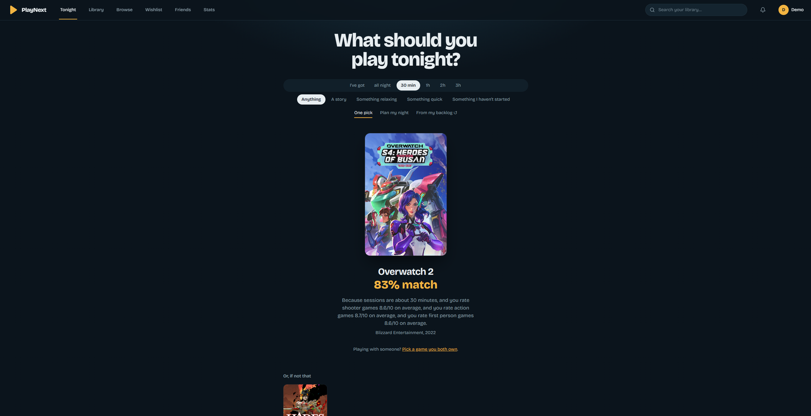
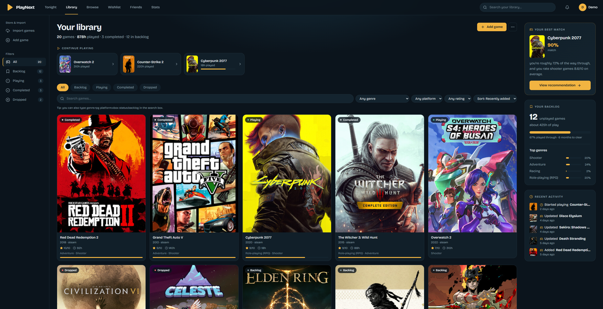
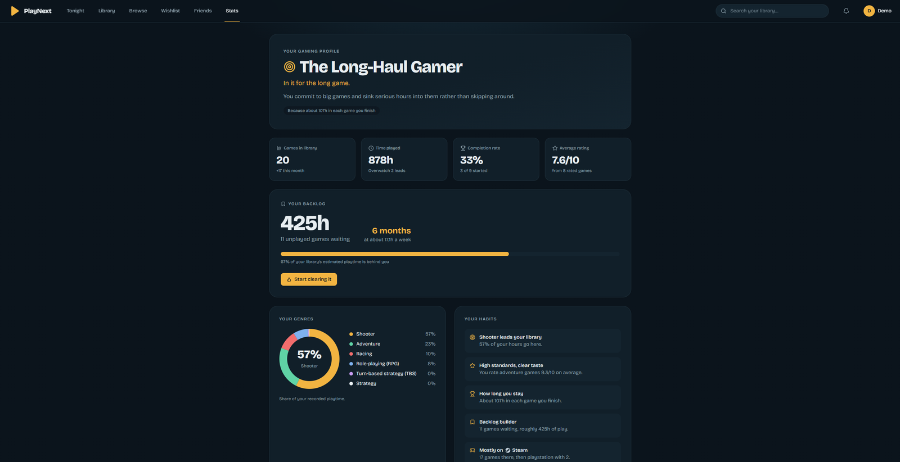

<h1 align="center">PlayNext</h1>
<p align="center"><strong>Stop scrolling. Start playing.</strong></p>
<p align="center">
  A cross-platform game library and backlog tracker with an explainable recommendation engine.
</p>
<p align="center">
  <a href="#live-demo">Live demo</a> ·
  <a href="#screenshots">Screenshots</a> ·
  <a href="#how-the-recommender-works">How the recommender works</a> ·
  <a href="#running-it-locally">Run it locally</a> ·
  <a href="#engineering-notes">Engineering notes</a>
</p>

---

Most people own far more games than they will ever play. PlayNext pulls a library together from
every launcher on a PC, works out someone's taste from what they have rated, finished and
abandoned, and answers one question: **what should I play tonight?**

Every recommendation explains itself. There are no opaque scores.

## Live demo

> **Not deployed yet.** `render.yaml` and `railway.json` are in the repo and the
> [deployment guide](#deploying-it) walks through it. Replace this section with the URL and
> `demo@playnext.app / demo1234` once it is up.

## Screenshots

> Add four images to `docs/` and they will appear here:
> `docs/tonight.png`, `docs/library.png`, `docs/game.png`, `docs/profile.png`

| Tonight | Library |
|---|---|
|  |  |

| Game page | Profile |
|---|---|
|  |  |

## What it does

- **Library** — a tile grid with hover quick-actions, a "Continue playing" row, filter tabs plus
  genre / platform / rating / sort controls, and a `genre:rpg platform:xbox` token syntax for
  power users. A context rail shows the best match with its reasoning, the backlog as a
  challenge, and recent activity.
- **Import in one click** — "Sign in with Steam" (OpenID) pulls everything owned on Steam with
  playtime. A single-file local scanner detects what is installed across Steam, Epic, GOG,
  Ubisoft Connect, EA, Battle.net, Xbox / Game Pass and publisher-registered launchers. Anything
  else (PlayStation, Switch) can be pasted in as a list. All three are idempotent.
- **Tonight** — say how long you have and what mood you are in, and get one pick with a 0–100
  match score and plain-English reasons. Or **Plan my night**, which fills the time with two or
  three games sized to a typical session.
- **Browse & wishlist** — search a catalogue of hundreds of thousands of games across every
  platform, filter by genre, platform, year and rating, page with infinite scroll, and wishlist
  anything. Buying it moves it to the backlog and keeps your notes.
- **Game pages** — key art behind the cover, a context-aware primary action, rating slider,
  progress against time-to-beat, journal notes with a spoiler toggle, platform badges marking
  where *you* own it, PC system requirements, trailers and screenshots, and "you might also like"
  from the same similarity engine.
- **Friends & co-op picks** — add people by username, then get games you **both** own that
  actually support playing together, ranked by both tastes averaged.
- **Accounts** — unique usernames, email confirmation, and password reset by email. Tokens are
  stored only as hashes, expire, and work once. "Forgot password" gives the same response whether
  or not the address exists, so it can't be used to discover who has registered.
- **Profile** — a gaming personality derived from real data (Shooter Specialist, Backlog Builder,
  Completionist and others), each showing the evidence it fired on, plus genre and status donuts,
  habit cards, and how many years the backlog would take at the current pace.

Every figure states what it was calculated from. "10/10 from 1 rated game", not a bare average.
Statistics with no data behind them show as absent rather than zero.

## How the recommender works

**Content-based.** Every game becomes a sparse vector over a shared vocabulary of tags — genre,
theme, player perspective, game mode, developer — each type weighted by how much it should
matter. A user's taste vector is the weighted sum of their rated games, where a 10/10 pulls
toward a game and a 3/10 pushes away; completed and abandoned games contribute a smaller
implicit signal even without a rating.

Candidates are ranked by cosine similarity to that vector, blended with critic score, then
filtered by the available time using HowLongToBeat-style figures. The reasons shown in the UI are
the tags that contributed most to the dot product, phrased with the user's own average rating for
that tag — so the explanation is derived from the maths, not written to sound plausible.

**Collaborative.** With several users rating games, user–user collaborative filtering adds what
content cannot see: that people with your taste liked something whose tags look nothing like your
usual picks. Similarity is Pearson rather than cosine, so it cancels out how generous each rater
is. It contributes 30% of the score where there is evidence for a game, and nothing at all where
there is not, so a thin dataset degrades to the content model instead of producing noise.

**Two players.** Co-op picks average both taste vectors and consider only games both people own
*and* that support multiplayer, co-op or split-screen. Games whose modes have not been fetched
count as unknown rather than being assumed playable.

See `backend/app/services/recommender.py`.

## Architecture

```
React 18 + TypeScript + Vite + Tailwind
                  │
                  ▼
       FastAPI  ·  Pydantic v2
                  │
        ┌─────────┴──────────┐
        ▼                    ▼
 Recommender (NumPy)   PostgreSQL (SQLAlchemy 2 + Alembic)
                             │
                             ▼
             IGDB · Steam Web API · Steam store · Microsoft Store
                    (all behind a TTL cache)
```

| Layer | Choice |
|---|---|
| Frontend | React 18, TypeScript, Vite, Tailwind, Vitest |
| API | FastAPI, Pydantic v2, SQLAlchemy 2, Alembic |
| Database | PostgreSQL in production, SQLite for local dev and tests |
| Recommender | NumPy (content-based + collaborative) |
| Auth | JWT, bcrypt, per-IP rate limiting, hashed single-use email tokens |
| External | IGDB (via Twitch OAuth), Steam Web API, Steam store, Microsoft Store catalogue |
| Infra | Docker, Docker Compose, GitHub Actions, Render/Railway configs |

## Running it locally

Nothing is required beyond Python 3.12 and Node 20. With no configuration at all it runs on
SQLite with a built-in catalogue.

```bash
# backend
cd backend
python -m venv .venv && source .venv/bin/activate    # .venv\Scripts\activate on Windows
pip install -r requirements.txt
alembic upgrade head
python -m app.demo                 # seeds a demo account and a friend to compare with
uvicorn app.main:app --reload      # http://localhost:8000/docs

# frontend, in a second terminal
cd frontend
npm install
npm run dev                        # http://localhost:5173
```

Sign in as `demo@playnext.app` / `demo1234` and open **Tonight**.

**With Docker and Postgres:**

```bash
cp .env.example .env               # then fill in whatever you have
docker compose up --build
docker compose exec backend python -m app.demo
```

### Optional API keys

Everything works without them; both unlock more.

| Variable | What it adds | Where to get it |
|---|---|---|
| `IGDB_CLIENT_ID`, `IGDB_CLIENT_SECRET` | Browse covers every platform's catalogue instead of Steam's only | [Twitch developer app](https://api-docs.igdb.com/#getting-started) (free) |
| `STEAM_API_KEY` | "Sign in with Steam" library import | [steamcommunity.com/dev/apikey](https://steamcommunity.com/dev/apikey) (free) |
| `MAIL_MODE=smtp` + `SMTP_*` | Real verification and password-reset emails | Any SMTP provider — [Resend](https://resend.com), [Brevo](https://www.brevo.com) or a Gmail app password |

Without mail configured the app runs in **console mode**: verification and reset links are logged
to the backend terminal instead of being sent, so the whole flow is testable locally. The UI hides
the "confirm your email" banner in that mode rather than pointing at an inbox that will never
receive anything.

The app tells you when a key is missing rather than offering a button that cannot work — see
`GET /config`.

## The local scanner

A web app cannot read a hard drive, so `scanner/playnext_scan.py` does what the NVIDIA and Xbox
apps do: reads each launcher's own records and reports what is installed.

| Launcher | How it is detected |
|---|---|
| Steam | `libraryfolders.vdf` → `appmanifest_*.acf` in every library (also macOS/Linux) |
| Epic | `%ProgramData%\Epic\EpicGamesLauncher\Data\Manifests\*.item` |
| GOG | `HKLM\SOFTWARE\WOW6432Node\GOG.com\Games` |
| Ubisoft | `HKLM\...\Ubisoft\Launcher\Installs` |
| EA | registry keys, the EA app's `InstallData`, and each game's `installerdata.xml` |
| Battle.net | `Battle.net.config` product codes, `product.db` paths, and Blizzard's uninstall entries |
| Xbox / Game Pass | Appx packages containing `MicrosoftGame.config`, plus its `StoreId` for poster art |
| Others | the Windows uninstall registry, filtered to game publishers |

Standard library only, so it runs as-is or as a one-file `.exe` via PyInstaller. It sends game
titles, the launcher, and a Store ID — nothing else.

## Testing

```bash
cd backend && pytest          # 67 tests
cd frontend && npm test       # 7 tests
```

Backend tests run on in-memory SQLite with all network calls stubbed, so CI needs no database and
never touches a third-party API.

## Deploying it

The repo contains a Render blueprint (`render.yaml`) that creates an API, a static frontend and a
Postgres database in one go, and a `railway.json` for Railway.

1. Push to GitHub.
2. **Render** → New → Blueprint → pick the repo. It reads `render.yaml`.
3. Add `IGDB_CLIENT_ID`, `IGDB_CLIENT_SECRET` and `STEAM_API_KEY` in the dashboard (they are
   marked `sync: false` so secrets stay out of the repo). `SECRET_KEY` is generated for you.
4. In the API service shell, run `python -m app.demo` to seed the demo account.
5. Put the URL and demo credentials at the top of this README.

`CORS_ORIGINS`, `PUBLIC_API_URL` and `FRONTEND_URL` are wired between services by the blueprint.
`VITE_API_URL` is inlined into the frontend bundle at build time.

## Engineering notes

Things that were not obvious, and what they cost:

- **Steam's CDN moved.** Older games' art lives on `cdn.cloudflare.steamstatic.com`, newer ones on
  `shared.cloudflare.steamstatic.com` inside a hashed folder, so portrait URLs cannot be
  constructed. The fix was Steam's own `IStoreBrowseService/GetItems` for exact filenames, with a
  client-side fallback chain for anything already stored.
- **HEAD lied.** Steam's CDN answers `HEAD` with 200 for files that do not exist, so verification
  had to become a streamed `GET` that checks the content type.
- **IGDB deprecated a field.** Filtering on `category` silently matched zero rows rather than
  erroring. Replaced with relational checks (`parent_game`, `version_parent`) that survive enum
  renames, plus a reduced-field retry so a future deprecation degrades instead of breaking.
- **Adding a column is two jobs.** `ALTER TABLE ADD COLUMN` leaves existing rows NULL, and
  SQLAlchemy's `default=list` only applies on insert — so every response carrying an old row
  failed validation. Migrations now backfill, and the schema coerces NULL to empty as a second
  line of defence.
- **An error handler became the error.** Logging `game.title` after a failed flush triggered a
  lazy reload on a rolled-back session, turning a handled integrity error into a 500. Identifiers
  are now read before the risky work.
- **Duplicate rows are legitimate.** A scanner import and a store search can both create a row for
  one game, and `steam_appid` is unique. Rather than failing, the second row now detects the clash
  before the flush and copies the first's metadata.
- **SQLite held the page hostage.** Long enrichment transactions blocked reads until WAL mode,
  per-game commits and background tasks were introduced.
- **Two clocks again.** Token expiry hit the same naive/aware datetime split as the stats page:
  SQLite returns timestamps without a timezone, Postgres with one. Normalised at the boundary.
- **Naive vs aware datetimes.** SQLite returns naive timestamps where Postgres returns aware ones,
  which crashed date comparisons in tests but would have worked in Docker.

## Roadmap

- HowLongToBeat integration to replace the seeded length estimates
- Redis for the third-party cache and the recommender matrix, so it survives multiple workers
- Per-session play tracking, which would enable "your usual session is 1h 47m" and a real activity log
- PlayStation import via a browser-extension export of the PSN library page

## Attribution

Game metadata, artwork and trailers come from [IGDB](https://www.igdb.com), the
[Steam](https://store.steampowered.com) store and Web API, and the Microsoft Store catalogue.
All artwork and trademarks belong to their respective publishers. Not affiliated with Valve,
Microsoft, Sony, Nintendo or any publisher.
